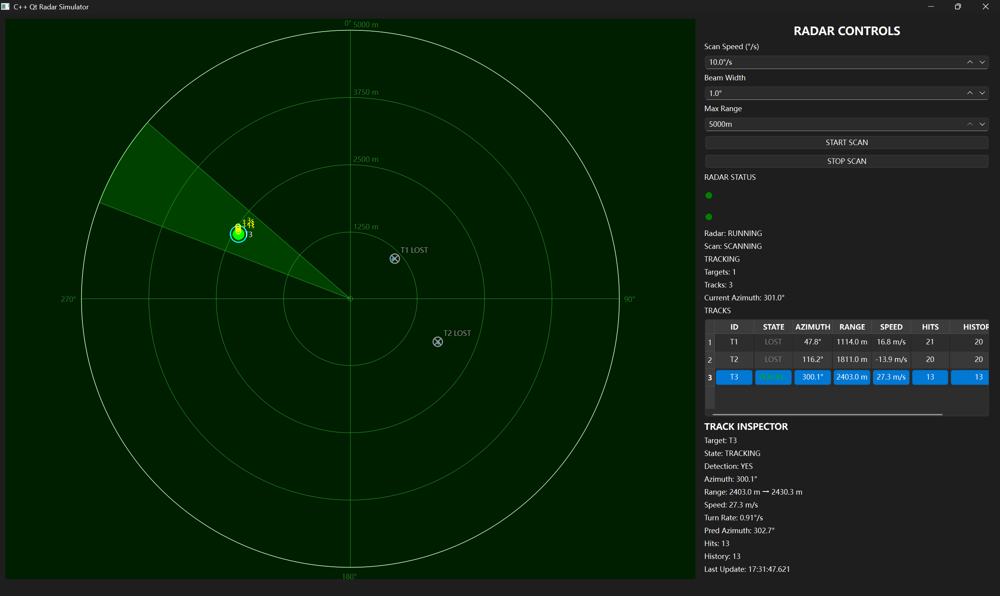
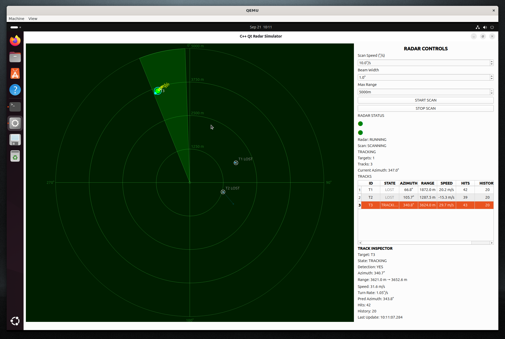
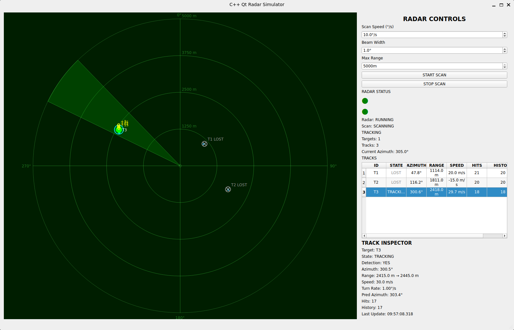

# RadarSimulator

一个基于 **C++17 + Qt6** 开发的桌面雷达模拟器项目。

项目主要用于学习和实践：

- Qt Widgets 桌面应用开发
- TCP 网络通信
- 自定义文本协议
- 雷达目标与坐标转换
- PPI 雷达界面绘制
- QPainter / QConicalGradient
- CMake
- Git
- 自动化测试

项目目前已经实现 TCP 控制、雷达扫描、目标显示、历史航迹、PPI 绘制以及基础测试功能。

---

## 项目效果



RadarSimulator 使用 Qt6 Widgets 构建桌面界面，通过 TCP 接收控制命令，并在 PPI 区域实时显示雷达扫描和目标状态。

主要功能包括：

- 雷达扫描启动与停止
- TCP 客户端连接
- 自定义文本协议解析
- 多客户端独立数据缓冲
- 雷达目标位置更新
- 雷达坐标到屏幕坐标转换
- PPI 距离环与方位刻度
- 动态扫描波束
- 目标点显示
- 历史航迹显示
- 目标信息表格
- CTest 自动化测试

---

## 技术栈

- C++17
- Qt 6
- Qt Widgets
- Qt Network
- QTcpServer
- QTcpSocket
- QPainter
- QConicalGradient
- QTimer
- CMake
- CTest
- Git

---

## 项目结构

```text
RadarSimulator
├── main.cpp
├── mainwindow.h
├── mainwindow.cpp
├── mainwindow.ui
├── RadarServer.h
├── RadarServer.cpp
├── RadarSimulation.h
├── RadarSimulation.cpp
├── RadarWidget.h
├── RadarWidget.cpp
├── shared
│   ├── LineBuffer.hpp
│   └── LineProtocol.hpp
├── tests
│   ├── protocol_test.cpp
│   ├── radar_server_state_test.cpp
│   └── tcp_client_test.cpp
├── docs
├── CMakeLists.txt
├── LICENSE
└── README.md
```

---

## 核心模块

### MainWindow

负责整个应用程序界面的组织与交互，包括：

- 按钮操作
- 状态显示
- 目标信息表格
- RadarWidget 管理

### RadarWidget

负责 PPI 雷达界面的绘制，包括：

- 雷达圆盘
- 距离环
- 方位刻度
- 扫描波束
- 目标点
- 历史航迹

核心绘图入口：

```cpp
void RadarWidget::paintEvent(QPaintEvent *event)
```

主要使用 Qt 的 `QPainter` 完成二维绘制。

### RadarServer

负责 TCP 服务端通信和命令处理，包括：

- 监听客户端连接
- 接收 TCP 数据
- 解析文本命令
- 控制雷达运行状态

当前默认监听端口：

```text
9000
```

### RadarSimulation

负责雷达模拟相关的数据与状态更新。

具体模拟逻辑以当前源码实现为准。

### LineBuffer

TCP 是字节流协议，因此一次 `readyRead()` 不一定对应一条完整命令。

`LineBuffer` 用于：

- 缓存 TCP 数据
- 处理分包
- 处理粘包
- 按 `\r\n` 提取完整文本帧

项目为每一个 `QTcpSocket` 保存独立缓冲区，避免不同客户端的数据互相拼接。

### LineProtocol

负责将文本命令解析为程序内部命令。

例如：

```text
START_SCAN
STOP_SCAN
MOVE ...
GET_STATUS
GET_POSITION
```

协议采用：

```text
\r\n
```

作为一条命令的结束标志。

---

## PPI 绘制原理

雷达目标可以通过距离和方位信息映射到 PPI 界面。

首先将目标实际距离映射到 PPI 半径：

```text
r_screen = range / maxRange × R
```

然后根据方位角计算屏幕坐标：

```text
x = cx + r_screen × sin(angle)
y = cy - r_screen × cos(angle)
```

其中 `(cx, cy)` 为雷达圆心。

Qt 屏幕坐标的 Y 轴向下，因此 Y 坐标需要进行方向转换。

PPI 绘制主要包括：

```text
背景
↓
距离环
↓
方位刻度
↓
扫描波束
↓
历史航迹
↓
当前目标
↓
文字信息
```

扫描波束使用 `QConicalGradient` 实现渐变效果。

---

## 动态刷新

雷达界面的基本刷新流程：

```text
QTimer
↓
更新扫描角度 / 目标状态
↓
update()
↓
paintEvent()
↓
QPainter 重新绘制
```

`paintEvent()` 主要负责显示，不负责核心业务状态更新。

---

## TCP 测试

项目包含一个 TCP 客户端测试程序：

```text
tcp_client_test
```

它可以连接正在运行的 RadarSimulator，并发送真实 TCP 命令。

例如：

```text
STOP_SCAN
```

服务端返回：

```text
STATUS SCAN_STOPPED
```

该测试主要用于验证完整 TCP 通信链路。

---

## 自动化测试

项目使用 CTest 管理自动化测试。

当前注册的测试包括：

```text
protocol_test
radar_server_state_test
```

### protocol_test

主要测试：

- LineBuffer
- 文本协议
- 分包处理
- 命令解析

### radar_server_state_test

主要测试：

- RadarServer 启动
- START_SCAN
- STOP_SCAN
- 雷达运行状态
- 扫描状态变化

执行测试：

```bash
ctest --test-dir build --output-on-failure
```

如果 Qt 自带的 CTest 没有加入 PATH，也可以使用完整路径执行，例如：

```bat
"D:\Qt\Tools\CMake_64\bin\ctest.exe" --test-dir "build目录" --output-on-failure
```

---

## 编译环境

当前项目主要开发和验证环境：

```text
Windows
Qt 6.11.1
MinGW 64-bit
CMake
C++17
```

推荐使用 Qt Creator，直接打开项目中的 `CMakeLists.txt` 进行配置和编译。

---

## 多环境验证

除了 Windows / Qt 主开发环境之外，项目还在 QEMU 和 WSL2 环境中进行了运行验证。

### QEMU



### WSL2



---

## 构建与运行

### 1. 克隆项目

Gitee：

```bash
git clone https://gitee.com/cyclone367/radar-simulator.git
```

GitHub：

```bash
git clone https://github.com/cyclone367/RadarSimulator.git
```

国内用户推荐优先使用 Gitee。

进入项目目录：

```bash
cd radar-simulator
```

### 2. 使用 Qt Creator

使用 Qt Creator 打开 `CMakeLists.txt`，选择 Qt6 MinGW Kit。

完成 CMake 配置后直接编译运行即可。

### 3. 启动 RadarSimulator

程序正常启动后，TCP 服务端会监听 9000 端口。

如果出现：

```text
The bound address is already in use
```

说明 9000 端口已经被其他程序占用。

可以使用以下命令检查端口：

```bat
netstat -ano | findstr :9000
```

---

## 系列文章

本项目配套教程持续更新中。

### 第一篇

**C++ Qt6 雷达模拟器实战（一）：项目架构与整体设计**

### 第二篇

**C++ Qt6 雷达模拟器实战（二）：TCP 通信与自定义文本协议**

### 第三篇

**C++ Qt6 雷达模拟器实战（三）：雷达目标、坐标转换与数学模型**

### 第四篇

**C++ Qt6 雷达模拟器实战（四）：使用 QPainter 绘制 PPI 雷达界面**

后续将继续介绍 TCP、雷达数据与 Qt 图形界面的完整整合。

---

## 相关内容

公众号：

```text
Junfeng的技术笔记
```

项目开发过程、技术文章和配套视频会持续更新。

---

## 项目仓库

Gitee：

https://gitee.com/cyclone367/radar-simulator

GitHub：

https://github.com/cyclone367/RadarSimulator

国内用户推荐优先访问 Gitee。

---

## 项目说明

本项目主要用于：

- C++ 学习
- Qt6 学习
- TCP 网络编程
- 桌面软件开发
- 雷达显示原理学习
- 项目实践与技术交流

项目中的雷达模型主要用于软件开发和可视化演示，并不是专业工程雷达信号处理系统。

如果本项目对你有帮助，欢迎 Star。

引用或二次发布时，请保留原项目版权及许可证信息。

---

## License

本项目采用 MIT License。

允许学习、使用、修改、分发和商业使用，但需要保留原始版权声明和许可证信息。

Copyright (c) 2026 Junfeng Li
